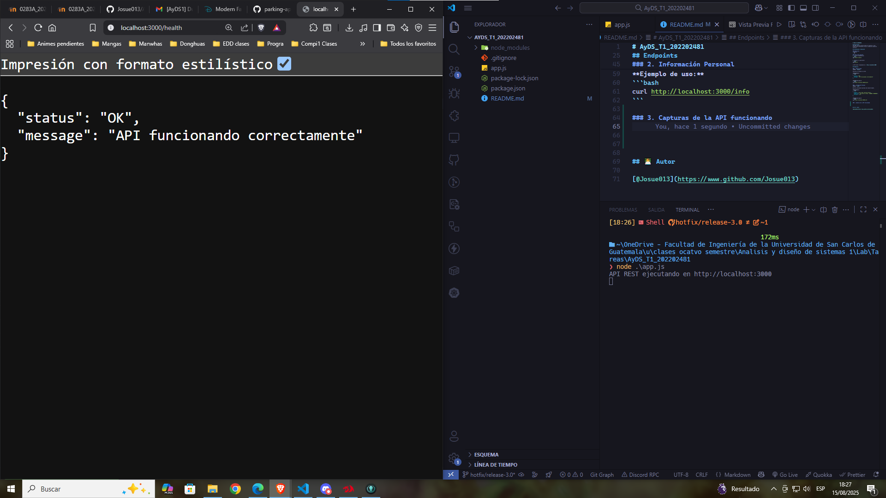
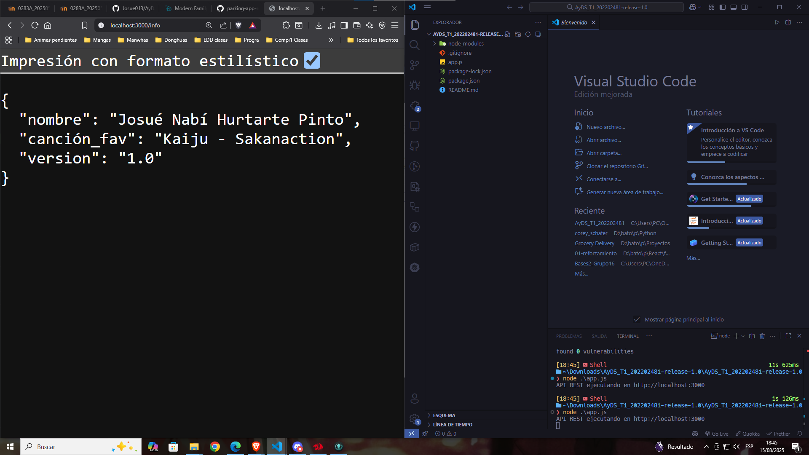
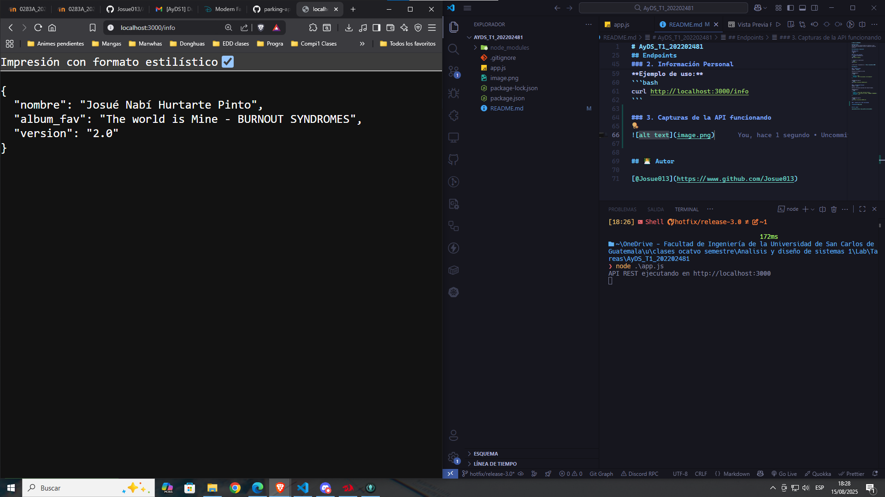
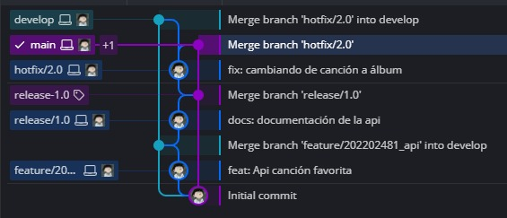
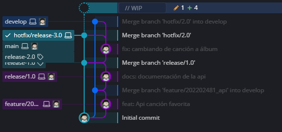
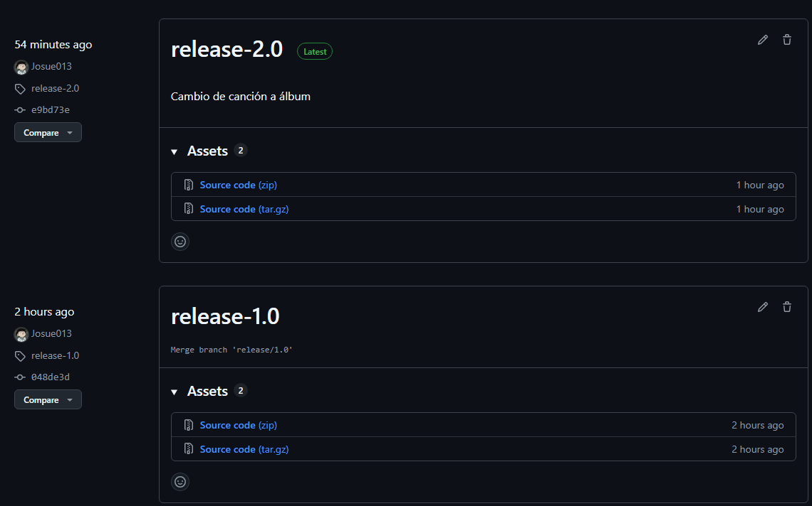

# AyDS_T1_202202481

## Descripción
API REST sencilla desarrollada con Express.js que proporciona información básica y estado de salud del servicio.

## Instalación y Ejecución

### Requisitos
- Node.js
- npm

### Pasos para ejecutar
1. Instalar dependencias:
```bash
npm install express
```

2. Ejecutar la aplicación:
```bash
node app.js
```

La API estará disponible en: `http://localhost:3000`

## Endpoints

### 1. Health Check
**GET** `/health`

Verifica el estado de la API.

**Respuesta:**
```json
{
  "status": "OK",
  "message": "API funcionando correctamente"
}
```

**Ejemplo de uso:**
```bash
curl http://localhost:3000/health
```

### 2. Información Personal
**GET** `/info`

Retorna información personal del desarrollador.

**Respuesta:**
```json
{
  "nombre": "Josué Nabí Hurtarte Pinto",
  "album_fav": "The world is Mine - BURNOUT SYNDROMES",
  "version": "2.0"
}
```

**Ejemplo de uso:**
```bash
curl http://localhost:3000/info
```

### 3. Capturas de la API funcionando





### 4. Pasos en GitKraken

**Proceso de desarrollo y manejo de versiones:**

Se implementó un flujo de trabajo con Git Flow siguiendo las mejores prácticas de versionado:

**Ramas creadas:**
- `main`: Rama principal de producción
- `develop`: Rama de desarrollo
- `feature/202202481_api`: Rama para desarrollar la funcionalidad inicial de la API
- `release/1.0`: Rama para preparar el primer release
- `hotfix/2.0`: Rama para corregir el error de canción → álbum (eliminada después del merge)
- `hotfix/3.0`: Rama adicional para agregar documentación (eliminada después del merge)

**Tags creados:**
- `release-1.0`: Versión inicial de la API mostrando canción favorita
- `release-2.0`: Corrección del hotfix cambiando de canción a álbum favorito
- `release-3.0`: Versión con documentación completa

**Flujo de trabajo seguido:**

1. **Desarrollo inicial**: Se creó la rama `feature/202202481_api` desde `develop` para implementar la API REST básica con endpoints `/health` e `/info` (mostrando canción favorita).

2. **Release 1.0**: Se generó la rama `release/1.0` y se creó el tag `release-1.0` para marcar la versión inicial.

3. **Hotfix 2.0**: Se identificó que debía mostrar álbum favorito en lugar de canción, por lo que se creó la rama `hotfix/2.0` desde `main`, se realizó la corrección, se hizo merge a `main` y `develop`, se creó el tag `release-2.0` y se eliminó la rama hotfix.

4. **Hotfix 3.0**: Se creó una rama adicional `hotfix/3.0` para agregar la documentación completa del proyecto, se realizó merge a `main`, se creó el tag `release-3.0` y se eliminó la rama.

**Captura del flujo antes de eliminar la rama hotfix/2.0:**


**Captura creando hotfix/3.0 para documentación:**


**Captura de los releases:**


Este flujo demuestra el uso correcto de Git Flow con ramas de feature, release y hotfix, así como el versionado semántico mediante tags.


## 👨‍💻 Autor

[@Josue013](https://www.github.com/Josue013)